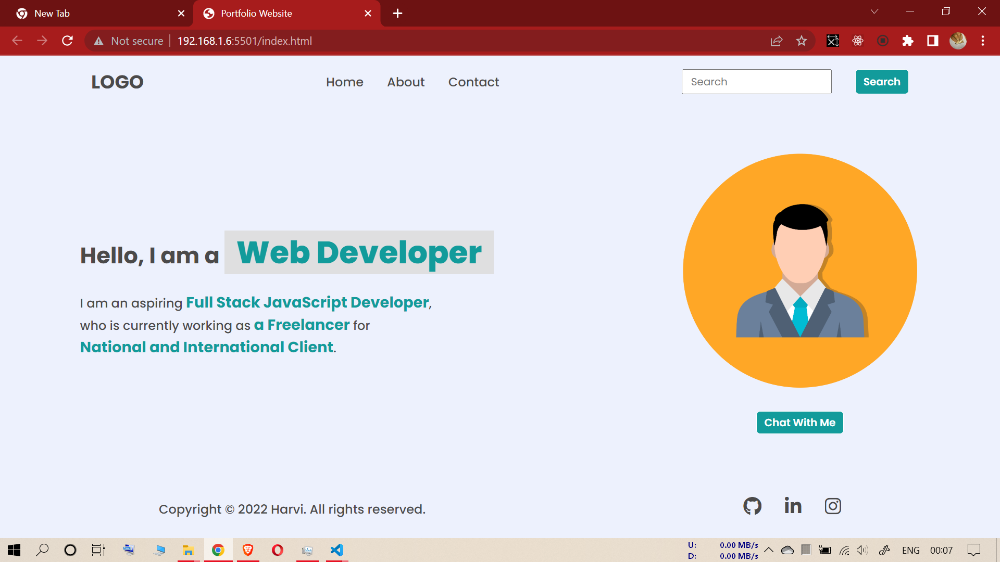
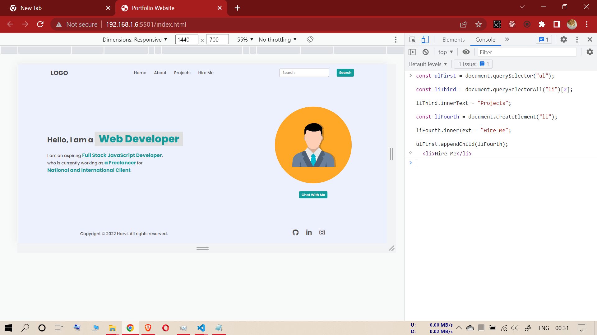
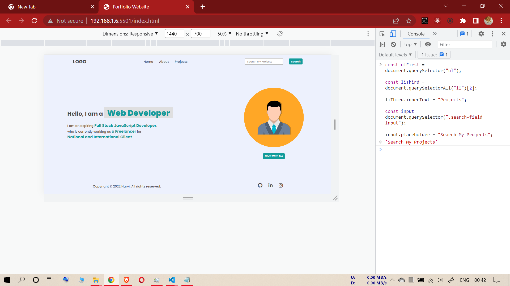
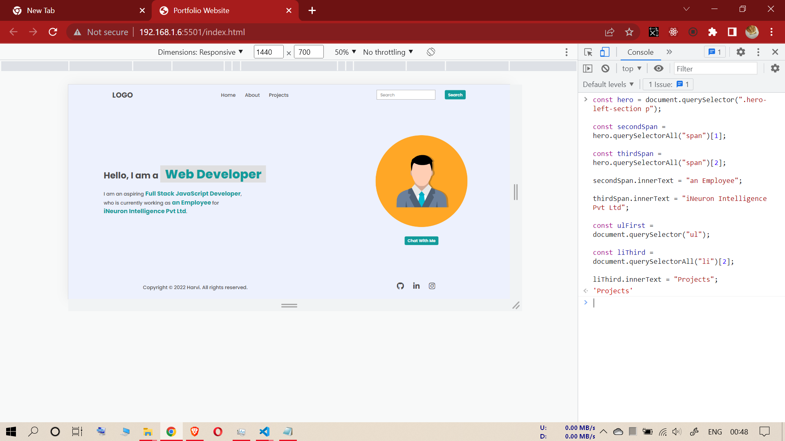
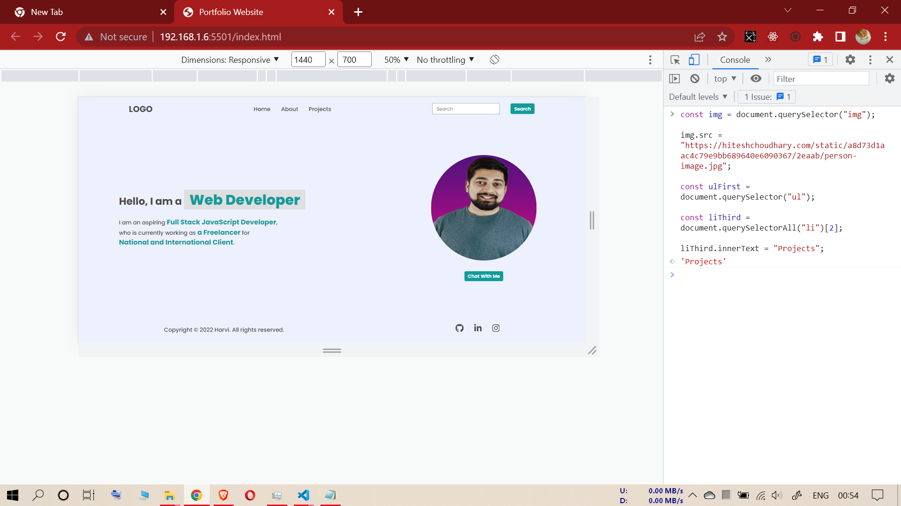
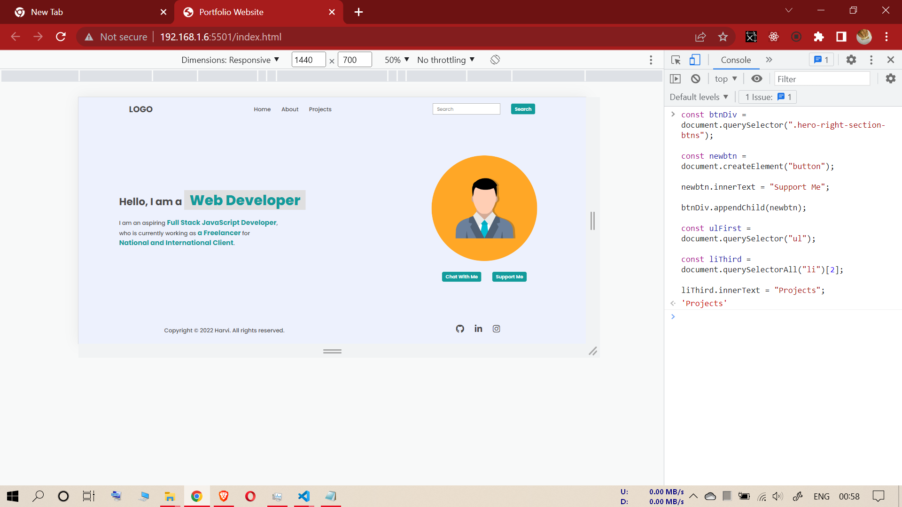
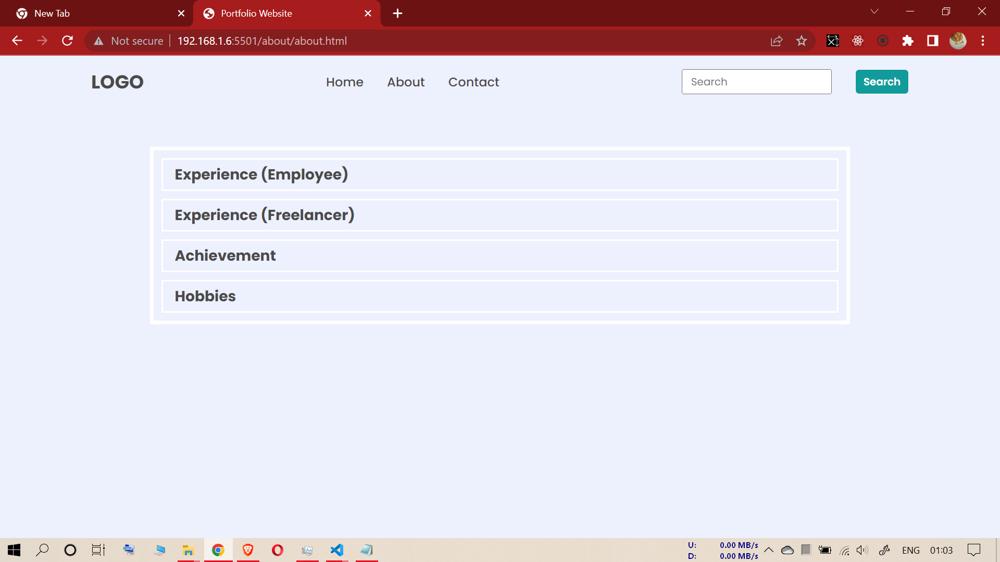
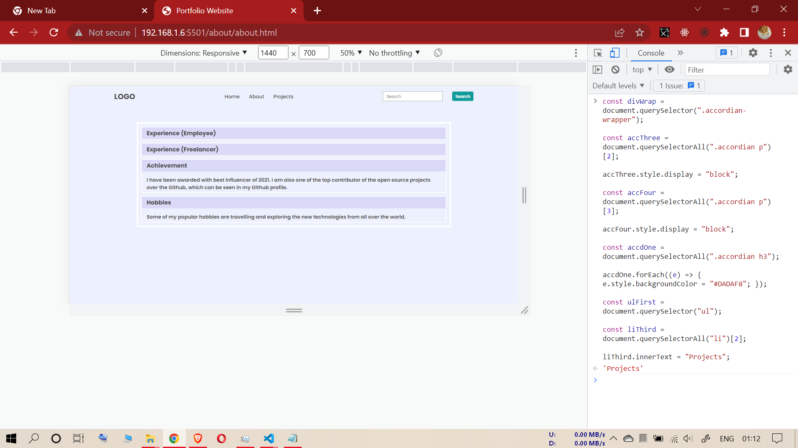
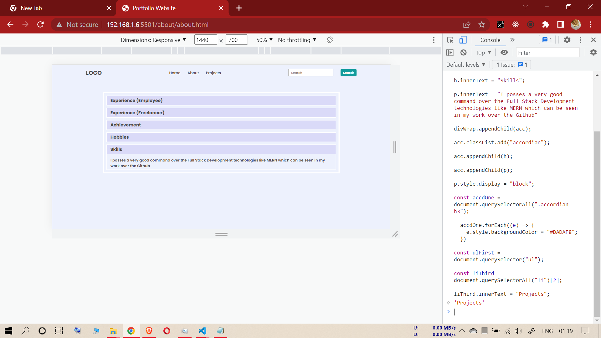
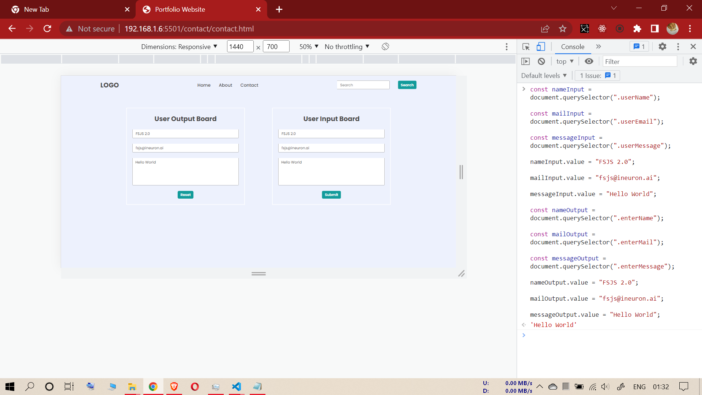

# FIRST ASSIGNMENT

## INPUT IMAGE

------------------------------------
## TASK-1 (First Assignment)
**(To change navbar third li to "Projects" from "Contact" and Creating fourth li with text "Hire Me"):**
### Code
const ulFirst = document.querySelector("ul");

const liThird = document.querySelectorAll("li")[2];

liThird.innerText = "Projects";

const liFourth = document.createElement("li");

liFourth.innerText = "Hire Me";
ulFirst.appendChild(liFourth);

------------------------------------
**task-1 output**

------------------------------------
------------------------------------

## TASK-2 (First Assignment)
**(To change the placeholder from "Search" to "Search My Project" +  changing "Contact" navbar list to "Project"):**
### Code

const ulFirst = document.querySelector("ul");

const liThird = document.querySelectorAll("li")[2];

liThird.innerText = "Projects";

const input = document.querySelector(".search-field input");

input.placeholder = "Search My Projects";

------------------------------------
**task-2 output**

------------------------------------
------------------------------------

## TASK-3 (First Assignment)
**(To change hero section paragraph span innerText + To "Contact" navbar list to "Project"):**
### Code

const hero = document.querySelector(".hero-left-section p");

const secondSpan = hero.querySelectorAll("span")[1];

const thirdSpan = hero.querySelectorAll("span")[2];

secondSpan.innerText = "an Employee";

thirdSpan.innerText = "iNeuron Intelligence Pvt Ltd";

const ulFirst = document.querySelector("ul");

const liThird = document.querySelectorAll("li")[2];

liThird.innerText = "Projects";

------------------------------------
**task-3 output**

------------------------------------
------------------------------------

## TASK-4 (First Assignment)
**(To change profile picture +  To change "Contact" navbar list to "Project"):**
### Code

const img = document.querySelector("img");

img.src = "https://hiteshchoudhary.com/static/a8d73d1aac4c79e9bb689640e6090367/2eaab/person-image.jpg";

const ulFirst = document.querySelector("ul");

const liThird = document.querySelectorAll("li")[2];

liThird.innerText = "Projects";

------------------------------------
**task-4 output**

------------------------------------
------------------------------------

## TASK-5 (First Assignment)
**(To add "Support Me" button next to "Chat With Me" button +  To change "Contact" navbar list to "Project"):**
### Code

const btnDiv = document.querySelector(".hero-right-section-btns");

const newbtn = document.createElement("button");

newbtn.innerText = "Support Me";

btnDiv.appendChild(newbtn);

const ulFirst = document.querySelector("ul");

const liThird = document.querySelectorAll("li")[2];

liThird.innerText = "Projects";

------------------------------------
**task-5 output**

------------------------------------
------------------------------------
------------------------------------

# SECOND ASSIGNMENT

## INPUT IMAGE

------------------------------------

## TASK-1 (Second Assignment)
**(To open "Achievement" and "Hobbies" tabs showing their paragraph + To change h3 headings background colors to "#DADAF8" + To change navbar third li to "Projects" from "Contact"):**
### Code

const divWrap = document.querySelector(".accordian-wrapper");

const accThree = document.querySelectorAll(".accordian p")[2];

accThree.style.display = "block";

const accFour = document.querySelectorAll(".accordian p")[3];

accFour.style.display = "block";

const accdOne = document.querySelectorAll(".accordian h3");

accdOne.forEach((e) => {
  e.style.backgroundColor = "#DADAF8";
});

const ulFirst = document.querySelector("ul");

const liThird = document.querySelectorAll("li")[2];

liThird.innerText = "Projects";

------------------------------------
**task-1 output**

------------------------------------
------------------------------------

## TASK-2 (Second Assignment)
**(To add a new h3 tab "Skills" and keeping it open with paragraph content + To change h3 headings background colors to "#DADAF8" + To change navbar third li to "Projects" from "Contact"):**
### Code

const divWrap = document.querySelector(".accordian-wrapper");

const acc = document.createElement("div");

const h = document.createElement("h3");

const p = document.createElement("p");

h.innerText = "Skills";

p.innerText = "I posses a very good command over the Full Stack Development technologies like MERN which can be seen in my work over the Github"

divWrap.appendChild(acc);

acc.classList.add("accordian");

acc.appendChild(h);

acc.appendChild(p);

p.style.display = "block";

const accdOne = document.querySelectorAll(".accordian h3");

  accdOne.forEach((e) => {
    e.style.backgroundColor = "#DADAF8";
  })

const ulFirst = document.querySelector("ul");

const liThird = document.querySelectorAll("li")[2];

liThird.innerText = "Projects";

------------------------------------
**task-2 output**

------------------------------------
------------------------------------
------------------------------------

# THIRD ASSIGNMENT

------------------------------------

## TASK-1 (Third Assignment)
**(To change the values in User Input Board + To change the values in User Output Board):**
### Code

const nameInput = document.querySelector(".userName");

const mailInput = document.querySelector(".userEmail");

const messageInput = document.querySelector(".userMessage");

nameInput.value = "FSJS 2.0";

mailInput.value = "fsjs@ineuron.ai";

messageInput.value = "Hello World";

const nameOutput = document.querySelector(".enterName");

const mailOutput = document.querySelector(".enterMail");

const messageOutput = document.querySelector(".enterMessage");

nameOutput.value = "FSJS 2.0";

mailOutput.value = "fsjs@ineuron.ai";

messageOutput.value = "Hello World";

------------------------------------
**task-1 output**

------------------------------------
------------------------------------
------------------------------------

### -----END OF FIRST, SECOND, AND THIRD ASSIGNMENT----

